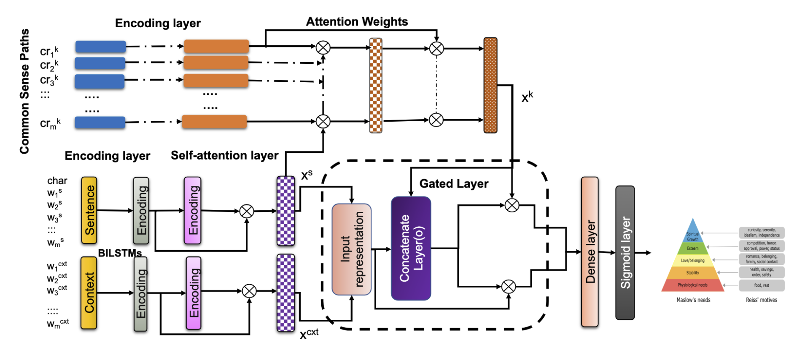

# Ranking and Selecting Multi-Hop Knowledge Paths to Better Predict Human Needs (NAACL 2019)
This directory contains the following parts of the 'Ranking and Selecting Multi-Hop Knowledge Paths to Better Predict Human Needs' experiment. We present a novel method to extract, rank, filter and select multi-hop relation paths from a commonsense knowledge resource to interpret the expression of sentiment in terms of their underlying human needs.

## Requirements 
~~~~
- python3+
- nltk
- igraph
- Tensorflow 
- Tensorflow-hub
~~~~

## Install
~~~~
- pip install tensorflow
- pip install tensorflow-hub
- pip install nltk
- pip install python-igraph
- pip install spacy 
- pip install sklearn
~~~~

## About Data
[Modeling Naive Psychology of Characters in Simple Commonsense Stories](https://uwnlp.github.io/storycommonsense/)

## ConceptNet: 
~~~
ConceptNet 5.6.0 
~~~
## Data prep : 

Please find more details in this [folder](https://github.com/debjitpaul/Multi-Hop-Knowledge-Paths-Human-Needs/tree/master/src/data_prep)


## Run
### Steps: 
### Construct ConceptNet into a graph: 
~~~
python src/graph_model/conceptnet2graph.py path_to_ConceptNet_csv_file
~~~

### To construct subgraph per sentence: 
~~~ 
python src/graph_model/make_sub_graph_server.py "inputfile" "graphpath" "outputpath" "--purpose" purpose
~~~
#### Requirements: 
[Input Sample](https://github.com/debjitpaul/Multi-Hop-Knowledge-Paths-Human-Needs/tree/master/src/data_prep/sample_data_reiss_concepts.txt) 
~~~
Inputfile: Path to the input file as mentioned in this Input Sample 
Graphpath: Path of the conceptnet as graph. 
Output path: Path to store the subgraph
Purpose: dev or train or test
~~~
### To extract relevant knowledge paths: 
~~~
python src/graph_model/extract_path.py --graph_path --input_path --output_path --input_path
               or 
./src/graph_model/run_extraction.sh
~~~
#### Requirements:
~~~~
Graphpath: Path of the subgraph. 
Inputfile: Path to the input file as mentioned in this Input sample
Output path: Path to store knowledge paths per context_sentence_ids. 
Purpose: dev or train or test
~~~~

### Data Format and Requirements:
~~~
Please find the data format in data_prep
~~~


### Finally, to run the neural model: 
~~~
bash /src/neural_model/run_experiment.sh
~~~


## Reference

If you make use of the contents of this repository, please cite [the following paper](https://www.aclweb.org/anthology/N19-1368):

```
@inproceedings{paul-frank-2019-ranking,
    title = "Ranking and Selecting Multi-Hop Knowledge Paths to Better Predict Human Needs",
    author = "Paul, Debjit  and
      Frank, Anette",
    booktitle = "Proceedings of the 2019 Conference of the North {A}merican Chapter of the Association for Computational Linguistics: Human Language Technologies, Volume 1 (Long and Short Papers)",
    month = jun,
    year = "2019",
    address = "Minneapolis, Minnesota",
    publisher = "Association for Computational Linguistics",
    url = "https://www.aclweb.org/anthology/N19-1368",
    pages = "3671--3681",
    abstract = "To make machines better understand sentiments, research needs to move from polarity identification to understanding the reasons that underlie the expression of sentiment. Categorizing the goals or needs of humans is one way to explain the expression of sentiment in text. Humans are good at understanding situations described in natural language and can easily connect them to the character{'}s psychological needs using commonsense knowledge. We present a novel method to extract, rank, filter and select multi-hop relation paths from a commonsense knowledge resource to interpret the expression of sentiment in terms of their underlying human needs. We efficiently integrate the acquired knowledge paths in a neural model that interfaces context representations with knowledge using a gated attention mechanism. We assess the model{'}s performance on a recently published dataset for categorizing human needs. Selectively integrating knowledge paths boosts performance and establishes a new state-of-the-art. Our model offers interpretability through the learned attention map over commonsense knowledge paths. Human evaluation highlights the relevance of the encoded knowledge.",
}
